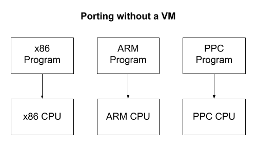
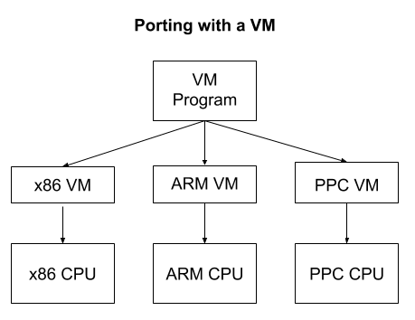

# Understanding Virtual Machines First-Hand

## Why VM?

Instead of rewriting a program in different dialects of assembly for each CPU architecture, you would only need to write the small VM program in each assembly language. Each program would then be written only once in the VM’s assembly language.

## A virtual machine:

1. Simulates CPU along w/ few hardware components
2. Allowing to perform operations like:

    a. Arithmetic
    b. R/W to memory
    c. Interact w/ I/O devices

3. VMs are also useful for executing code in a secure or isolated way. One application of this is garbage collection. There is no trivial way to implement automatic garbage collection on top of C or C++ since a program cannot see its own stack or variables. However, a VM is “outside” the program it is running and can observe all of the memory references on the stack.

4. A VM doesn’t have to be large or pervasive to provide a similar benefit. Old video games often used small VMs to provide simple scripting systems.

## Examples of successful VMs

1. JVM - Java Virtual Machine

- Once the JVM is implemented on a new device, any Java, Kotlin, or Clojure program ever written can run on it without modification.

2. EVM - Ethereum Virtual Machine

- Smart contracts are small programs which are executed by each validating node in the blockchain network. 
- This requires the node operators to run programs on their machines that have been written by complete strangers, without any opportunity to scrutinize them beforehand. 
- To prevent a contract from doing malicious things, they are run inside a VM that has no access to the file system, network, disc, etc. 
- Ethereum is also a good application of the portability features that result when using a VM. Since Ethereum nodes can be run on many kinds of computers and operating systems, the use of a VM allows smart contracts to be written without any consideration of the many platforms they run on.
